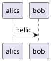

#How to setup PlantUML support

##macos

```
brew install --cask temurin
brew install graphviz
brew install plantuml
```

Start the PlantUML PicoWeb Server:
PlantUML includes a lightweight web server (PicoWeb) that can be started from the command line. To run the PlantUML server, execute:
Код

```
    plantuml -picoweb
```

This command will typically start the server on http://localhost:8080/. You can then access the PlantUML server's web interface in your browser to generate diagrams.


##vscode extension

Launch VS Code Quick Open (Ctrl+P), paste the following command, and press enter.
```
ext install plantuml
```

